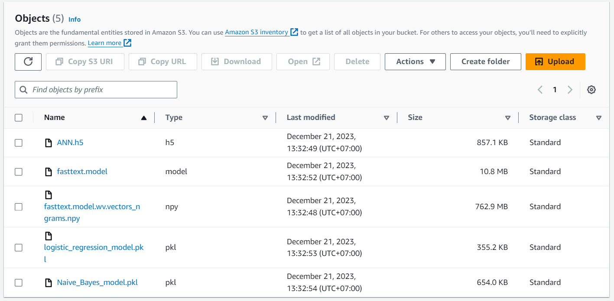

# Sentiment Analysis

## Introduction

- Đây là dự án nhóm dùng bộ dữ liệu được **crawl** trực tiếp từ sàn thương mại điện **Tiki** ở danh mục [Nhà sách tiki](https://tiki.vn/nha-sach-tiki/c8322).
- Dự án được áp dụng nhiều loại mô hình học máy phổ biển để dự đoán cảm xúc của các review như **Naive Bayes**, **Maxent**, **ANN**.

## Directory structure

- Gồm 3 folder chính: client, server, colab
- client: Nơi chứa code giao diện người dùng (client-side)
- server: Nơi chưa code phần server-side
- colab: Nơi chứa code thực hiện crawl, xử lý dữ liệu và xuất ra model.

## User manual

- Vì kích thước của file **fasttext.model.wv.vectors_ngrams.npy** khá lớn nên nhóm lưu trữ mô hình này ở **S3** của **AWS**

- Link download: [fasttext.model.wv.vectors_ngrams.npy](https://sentiment-analyzer.s3.ap-southeast-1.amazonaws.com/Models/fasttext.model.wv.vectors_ngrams.npy)

- Sau khi download và bỏ vào thư mục models ở phần server là sử đụng được.

## Data size

##### 51 pages, 4 review page of each product

- Ở trang danh mục Nhà sách tiki có **51 trang** và mỗi sản phẩm trong **1 trang** lại có nhiều review. Vì kích thước khá lớn, nên nhóm lấy **51 trang** ở danh mục Nhà sách Tiki và mỗi sản phẩm chỉ lấy **4 trang** review.

## Technologies

- Dự án được viết theo mô hình **client-server**. Client đóng vai trò là nơi nhận **API** từ phiá server trả về.

#### Frontend

- Sử dụng **ReactJS** là framework cho phía client cùng với build tool là **Vite** để tối ưu hiệu suất trong quá trong khởi tạo dự án với thời gian cải thiện đáng kể.

#### Backend

- Sử dụng **Flask** là framework chính để dựng server cung cấp **API** cho client. Nơi đây lưu trữ các mô hình đã được huấn luyện để dự đoán cảm xúc của một đoạn review.

## Link Deploy

- Frontend: [sentiment-app](https://sentiment-analyzer-app.vercel.app/)
- Backend: [sentiment-analyzer-api](https://sentiment-analysis-api-aqfj.onrender.com)

- **Note: Vì kích thước model fastest khá lớn, do vậy nhóm không push lên github được nên Link deploy chỉ sử dụng được mô hình Naive Bayes và Maxent. Để sử dụng toàn bộ tín năng hãy tải folder client và server về chạy ở local.**

## Conclusion

- Sau khi phân tích, đánh giá và chạy thử kết quả từ mô hình thì nhóm nhận thấy kết quả tương đối chính xác với nhưng gì dữ liệu được huấn luyện, vì bộ dự liệu hầu hết là các review tích cực nên kết quả dự đoán thiên hướng về positive. Tuy nhiên để cải thiện điều này chỉ cần cho mô hình học bộ dữ liệu đa dạng hơn.

- Mặc dù cố gắng hết sức để đem lại kết quả dự đoán tốt nhất cũng như về UI UX nhưng không thể tránh khỏi những sai sót. Nhóm mình rất mong được sự góp ý từ thầy và các bạn.
